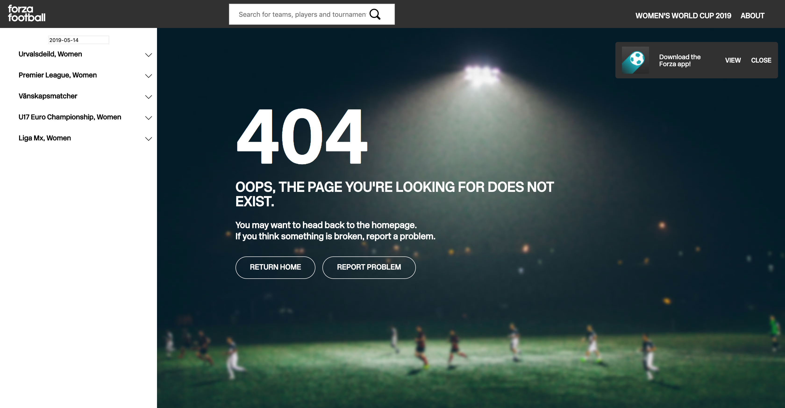
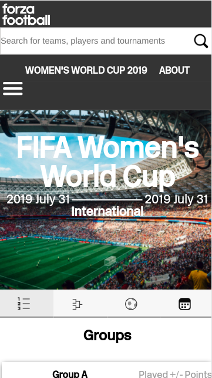
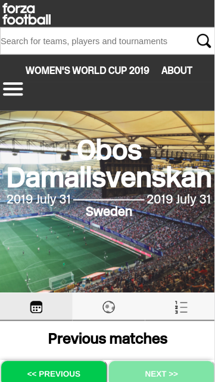
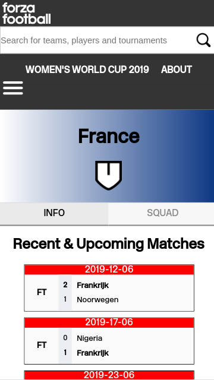
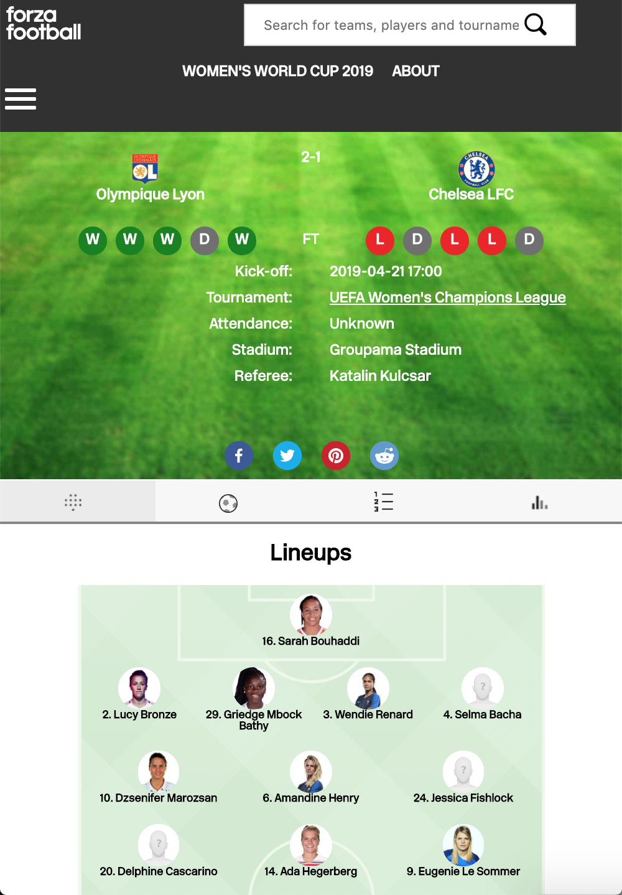

# Bachelor Thesis in Computer Science 2019 [PHOTOS]
Computer Science and Engineering Department at [Chalmers University of Technology](https://chalmers.se/en) and [University of Gothenburg](https://gu.se/english)
in collaboration with [Forza Football](https://forzafootboll.com).

Title: _Auto-generated Web Application for User Acquisition through SEO within Women’s Football_
## ⚽️ Overview  
The main purpose of the thesis was to create and develop a web application with auto-generated content and to investigate how it can be utilized to acquire users to a smartphone application. Consequently, a web application was developed in collaboration with Forza Football. 

At the time of finalizing the thesis, the platform had been live for roughly two months at [https://womens-livescore.forzafootball.com](https://womens-livescore.forzafootball.com). The creation of the web application was aided by a variety of libraries and frame- works. Using a combination of [Next.js](https://nextjs.org/) and an external REST data source, it was possible to automatically generate content on the web page, rendering it discov- erable by Google’s crawlers. The frontend was built using [React](https://reactjs.org).

The platform succeeded in ranking as the first result for some of the targeted search queries and got more than 350 000 impressions on Google's Search Engine during the two months. 

## 📖 Table of Contents 
1. [Group Members 🤓](#group-members)
2. [Desktop View 🖥](#desktop-view)
3. [Smartphone View 📱](#smartphone-view)
3. [Tablet View 📱](#tablet-view)
### Group members: 
<table style="width:100%">
    <tr>
      <th>Name</th>
      <th>Program</th> 
    </tr>
    <tr>
      <th> Adam Englund </th>
      <th> Industrial Engineering and Management </th>
    </tr>
    <tr>
      <th> Bawan Abdulla </th>
      <th> Industrial Engineering and Management</th>
    </tr>
    <tr>
      <th> Belmin Dervisevic </th>
      <th> Computer Science and Engineering </th>
    </tr>
     <tr>
      <th> Eric Shao </th>
      <th> Software Engineering </th>
    </tr>
    <tr>
      <th> Gustav Albertsson </th>
      <th> Computer Science </th>
    </tr>
      <tr>
      <th> Robin Hekmatara </th>
      <th> Computer Science </th>
    </tr>
</table>

## Desktop View

Figure 1: An auto-generated page for an arbitrary match.

Figure 2: A custom page was developed specifically for the Women’s World Cup.

Figure 3: An auto-generated page for a arbitrary tournament.

Figure 4: An auto-generated page for a arbitrary team.

Figure 5: An auto-generated page for an arbitrary player.

Figure 6: A custom page was developed specifically for the 404 Error Page.

Figure 7: A search page.

## Smartphone View

  
   

  
   

## Tablet View

 

